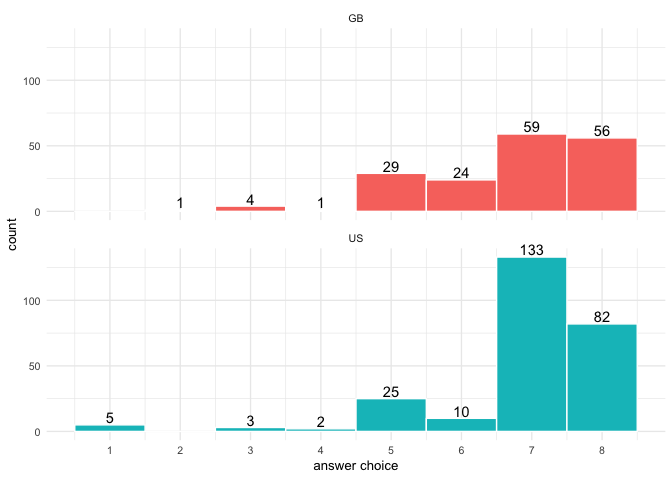

Exploring rtweet
================

## Machine learning flashcards

Looking for a way to reinforce machine learning concepts, I happened
upon the Chris Albon’s [Machine Learning
Flashcards](https://machinelearningflashcards.com/) on Twitter. And,
after reading the accompanying website, I noticed that Chris links to [a
Python repo](https://github.com/Dpananos/GetCards) that scrapes the
images from Chris’s Twitter feed. I thought I would try to do the same
using R so here we go:

### Pull tweets and inspect the output

First, we have a go at pulling tweets from Chris’s feed via
`rtweet`:

``` r
albon_tweets <- get_timeline(user = "chrisalbon", n = 3200)  # max return value
head(albon_tweets)
#> # A tibble: 6 x 88
#>   user_id status_id created_at          screen_name text  source display_text_wi… reply_to_status…
#>   <chr>   <chr>     <dttm>              <chr>       <chr> <chr>             <dbl> <chr>           
#> 1 115185… 11004606… 2019-02-26 18:20:41 chrisalbon  Why … Machi…               56 <NA>            
#> 2 115185… 11004598… 2019-02-26 18:17:23 chrisalbon  appl… Twitt…              121 <NA>            
#> 3 115185… 11002769… 2019-02-26 06:10:50 chrisalbon  @Mat… Twitt…               74 110011972331080…
#> 4 115185… 11002652… 2019-02-26 05:24:17 chrisalbon  Base… Twitt…              126 <NA>            
#> 5 115185… 11002641… 2019-02-26 05:19:46 chrisalbon  @Arm… Twitt…               75 110026331067340…
#> 6 115185… 11002623… 2019-02-26 05:12:33 chrisalbon  @Ath… Twitt…               67 110026216288536…
#> # … with 80 more variables: reply_to_user_id <chr>, reply_to_screen_name <chr>, is_quote <lgl>,
#> #   is_retweet <lgl>, favorite_count <int>, retweet_count <int>, hashtags <list>, symbols <list>,
#> #   urls_url <list>, urls_t.co <list>, urls_expanded_url <list>, media_url <list>, media_t.co <list>,
#> #   media_expanded_url <list>, media_type <list>, ext_media_url <list>, ext_media_t.co <list>,
#> #   ext_media_expanded_url <list>, ext_media_type <chr>, mentions_user_id <list>,
#> #   mentions_screen_name <list>, lang <chr>, quoted_status_id <chr>, quoted_text <chr>,
#> #   quoted_created_at <dttm>, quoted_source <chr>, quoted_favorite_count <int>, quoted_retweet_count <int>,
#> #   quoted_user_id <chr>, quoted_screen_name <chr>, quoted_name <chr>, quoted_followers_count <int>,
#> #   quoted_friends_count <int>, quoted_statuses_count <int>, quoted_location <chr>, quoted_description <chr>,
#> #   quoted_verified <lgl>, retweet_status_id <chr>, retweet_text <chr>, retweet_created_at <dttm>,
#> #   retweet_source <chr>, retweet_favorite_count <int>, retweet_retweet_count <int>, retweet_user_id <chr>,
#> #   retweet_screen_name <chr>, retweet_name <chr>, retweet_followers_count <int>,
#> #   retweet_friends_count <int>, retweet_statuses_count <int>, retweet_location <chr>,
#> #   retweet_description <chr>, retweet_verified <lgl>, place_url <chr>, place_name <chr>,
#> #   place_full_name <chr>, place_type <chr>, country <chr>, country_code <chr>, geo_coords <list>,
#> #   coords_coords <list>, bbox_coords <list>, status_url <chr>, name <chr>, location <chr>,
#> #   description <chr>, url <chr>, protected <lgl>, followers_count <int>, friends_count <int>,
#> #   listed_count <int>, statuses_count <int>, favourites_count <int>, account_created_at <dttm>,
#> #   verified <lgl>, profile_url <chr>, profile_expanded_url <chr>, account_lang <chr>,
#> #   profile_banner_url <chr>, profile_background_url <chr>, profile_image_url <chr>
```

Okay, after reading Twitter’s standard search API
[documentation](https://developer.twitter.com/en/docs/tweets/search/overview/standard)
we see that the standard search API will only return a sampling of the
user’s Tweets published in the past **7 days**. So, we will be
retrieving just a sample of Chris’s handy flashcards.

Also, there were nearly 90 variables returned so let’s take a `glimpse`
and zero in on what is essential for this specific task:

``` r
glimpse(albon_tweets)
#> Observations: 511
#> Variables: 88
#> $ user_id                 <chr> "11518572", "11518572", "11518572", "11518572", "11518572", "11518572", "11…
#> $ status_id               <chr> "1100460658062053377", "1100459830236598280", "1100276988403544064", "11002…
#> $ created_at              <dttm> 2019-02-26 18:20:41, 2019-02-26 18:17:23, 2019-02-26 06:10:50, 2019-02-26 …
#> $ screen_name             <chr> "chrisalbon", "chrisalbon", "chrisalbon", "chrisalbon", "chrisalbon", "chri…
#> $ text                    <chr> "Why Is It Called A Cost Function https://t.co/eZ2bbpDzwV https://t.co/uQcS…
#> $ source                  <chr> "Machine Learning Flashcards", "Twitter for iPhone", "Twitter for iPhone", …
#> $ display_text_width      <dbl> 56, 121, 74, 126, 75, 67, 4, 65, 3, 25, 48, 81, 194, 88, 118, 140, 35, 55, …
#> $ reply_to_status_id      <chr> NA, NA, "1100119723310804994", NA, "1100263310673403904", "1100262162885369…
#> $ reply_to_user_id        <chr> NA, NA, "110474012", NA, "22803302", "14794913", "254873869", NA, "15033509…
#> $ reply_to_screen_name    <chr> NA, NA, "MattGallagher0", NA, "ArmsControlWonk", "AthertonKD", "LibyaLibert…
#> $ is_quote                <lgl> FALSE, FALSE, FALSE, FALSE, FALSE, FALSE, FALSE, FALSE, FALSE, FALSE, FALSE…
#> $ is_retweet              <lgl> FALSE, TRUE, FALSE, FALSE, FALSE, FALSE, FALSE, TRUE, FALSE, FALSE, FALSE, …
#> $ favorite_count          <int> 13, 0, 0, 96, 0, 4, 1, 0, 1, 1, 2, 2, 53, 10, 0, 0, 10, 30, 1, 16, 2, 2, 7,…
#> $ retweet_count           <int> 1, 40, 0, 10, 0, 0, 0, 70, 0, 0, 0, 0, 3, 1, 136, 3, 3, 10, 0, 1, 0, 0, 0, …
#> $ hashtags                <list> [NA, NA, NA, NA, NA, NA, NA, NA, NA, NA, NA, NA, NA, NA, NA, NA, NA, NA, N…
#> $ symbols                 <list> [NA, NA, NA, NA, NA, NA, NA, NA, NA, NA, NA, NA, NA, NA, NA, NA, NA, NA, N…
#> $ urls_url                <list> ["machinelearningflashcards.com", "twitter.com/ThingsCutInHaI…", NA, NA, N…
#> $ urls_t.co               <list> ["https://t.co/eZ2bbpDzwV", "https://t.co/soAVycbQF5", NA, NA, NA, NA, NA,…
#> $ urls_expanded_url       <list> ["https://machinelearningflashcards.com", "https://twitter.com/ThingsCutIn…
#> $ media_url               <list> ["http://pbs.twimg.com/media/D0WfIxDV4AASlGA.png", NA, NA, NA, NA, NA, NA,…
#> $ media_t.co              <list> ["https://t.co/uQcSZUCTvN", NA, NA, NA, NA, NA, NA, "https://t.co/ScuLbVqw…
#> $ media_expanded_url      <list> ["https://twitter.com/chrisalbon/status/1100460658062053377/photo/1", NA, …
#> $ media_type              <list> ["photo", NA, NA, NA, NA, NA, NA, "photo", NA, NA, NA, NA, NA, NA, "photo"…
#> $ ext_media_url           <list> ["http://pbs.twimg.com/media/D0WfIxDV4AASlGA.png", NA, NA, NA, NA, NA, NA,…
#> $ ext_media_t.co          <list> ["https://t.co/uQcSZUCTvN", NA, NA, NA, NA, NA, NA, "https://t.co/ScuLbVqw…
#> $ ext_media_expanded_url  <list> ["https://twitter.com/chrisalbon/status/1100460658062053377/photo/1", NA, …
#> $ ext_media_type          <chr> NA, NA, NA, NA, NA, NA, NA, NA, NA, NA, NA, NA, NA, NA, NA, NA, NA, NA, NA,…
#> $ mentions_user_id        <list> [NA, "47436444", <"110474012", "291493735">, NA, <"22803302", "14794913">,…
#> $ mentions_screen_name    <list> [NA, "jrmontag", <"MattGallagher0", "HeyTeachBK">, NA, <"ArmsControlWonk",…
#> $ lang                    <chr> "en", "en", "en", "en", "en", "en", "fr", "en", "und", "en", "en", "en", "e…
#> $ quoted_status_id        <chr> NA, NA, NA, NA, NA, NA, NA, NA, NA, NA, NA, NA, "1099319654563147777", NA, …
#> $ quoted_text             <chr> NA, NA, NA, NA, NA, NA, NA, NA, NA, NA, NA, NA, "Bill Maher says red state …
#> $ quoted_created_at       <dttm> NA, NA, NA, NA, NA, NA, NA, NA, NA, NA, NA, NA, 2019-02-23 14:46:44, NA, N…
#> $ quoted_source           <chr> NA, NA, NA, NA, NA, NA, NA, NA, NA, NA, NA, NA, "SocialFlow", NA, NA, NA, "…
#> $ quoted_favorite_count   <int> NA, NA, NA, NA, NA, NA, NA, NA, NA, NA, NA, NA, 2553, NA, NA, NA, 1198, NA,…
#> $ quoted_retweet_count    <int> NA, NA, NA, NA, NA, NA, NA, NA, NA, NA, NA, NA, 766, NA, NA, NA, 302, NA, N…
#> $ quoted_user_id          <chr> NA, NA, NA, NA, NA, NA, NA, NA, NA, NA, NA, NA, "2884771", NA, NA, NA, "687…
#> $ quoted_screen_name      <chr> NA, NA, NA, NA, NA, NA, NA, NA, NA, NA, NA, NA, "Newsweek", NA, NA, NA, "fc…
#> $ quoted_name             <chr> NA, NA, NA, NA, NA, NA, NA, NA, NA, NA, NA, NA, "Newsweek", NA, NA, NA, "Fr…
#> $ quoted_followers_count  <int> NA, NA, NA, NA, NA, NA, NA, NA, NA, NA, NA, NA, 3318620, NA, NA, NA, 132899…
#> $ quoted_friends_count    <int> NA, NA, NA, NA, NA, NA, NA, NA, NA, NA, NA, NA, 494, NA, NA, NA, 599, NA, N…
#> $ quoted_statuses_count   <int> NA, NA, NA, NA, NA, NA, NA, NA, NA, NA, NA, NA, 186312, NA, NA, NA, 11060, …
#> $ quoted_location         <chr> NA, NA, NA, NA, NA, NA, NA, NA, NA, NA, NA, NA, "New York, NY", NA, NA, NA,…
#> $ quoted_description      <chr> NA, NA, NA, NA, NA, NA, NA, NA, NA, NA, NA, NA, "Stay relevant. News and an…
#> $ quoted_verified         <lgl> NA, NA, NA, NA, NA, NA, NA, NA, NA, NA, NA, NA, TRUE, NA, NA, NA, TRUE, NA,…
#> $ retweet_status_id       <chr> NA, "1100432336905068544", NA, NA, NA, NA, NA, "1099900359324127232", NA, N…
#> $ retweet_text            <chr> NA, "applying for a data science job in 2010 vs. applying for a data scienc…
#> $ retweet_created_at      <dttm> NA, 2019-02-26 16:28:08, NA, NA, NA, NA, NA, 2019-02-25 05:14:15, NA, NA, …
#> $ retweet_source          <chr> NA, "Twitter Web App", NA, NA, NA, NA, NA, "Twitter for iPhone", NA, NA, NA…
#> $ retweet_favorite_count  <int> NA, 192, NA, NA, NA, NA, NA, 362, NA, NA, NA, NA, NA, NA, 760, 27, NA, NA, …
#> $ retweet_retweet_count   <int> NA, 40, NA, NA, NA, NA, NA, 70, NA, NA, NA, NA, NA, NA, 136, 3, NA, NA, NA,…
#> $ retweet_user_id         <chr> NA, "47436444", NA, NA, NA, NA, NA, "1558406653", NA, NA, NA, NA, NA, NA, "…
#> $ retweet_screen_name     <chr> NA, "jrmontag", NA, NA, NA, NA, NA, "EpiEllie", NA, NA, NA, NA, NA, NA, "ik…
#> $ retweet_name            <chr> NA, "Josh Montague \U0001f4ca\U0001f389", NA, NA, NA, NA, NA, "Ellie Murray…
#> $ retweet_followers_count <int> NA, 2933, NA, NA, NA, NA, NA, 4569, NA, NA, NA, NA, NA, NA, 1911, 6947, NA,…
#> $ retweet_friends_count   <int> NA, 2617, NA, NA, NA, NA, NA, 1169, NA, NA, NA, NA, NA, NA, 782, 150, NA, N…
#> $ retweet_statuses_count  <int> NA, 40326, NA, NA, NA, NA, NA, 12511, NA, NA, NA, NA, NA, NA, 9820, 2141, N…
#> $ retweet_location        <chr> NA, "Golden + Boulder (CO)", NA, NA, NA, NA, NA, "", NA, NA, NA, NA, NA, NA…
#> $ retweet_description     <chr> NA, "counts \U0001f425\U0001f4ac, drinks \u2615️, takes \U0001f4f7, loves \…
#> $ retweet_verified        <lgl> NA, FALSE, NA, NA, NA, NA, NA, FALSE, NA, NA, NA, NA, NA, NA, FALSE, FALSE,…
#> $ place_url               <chr> NA, NA, "https://api.twitter.com/1.1/geo/id/fbd6d2f5a4e4a15e.json", "https:…
#> $ place_name              <chr> NA, NA, "California", "California", "California", "California", "California…
#> $ place_full_name         <chr> NA, NA, "California, USA", "California, USA", "California, USA", "Californi…
#> $ place_type              <chr> NA, NA, "admin", "admin", "admin", "admin", "admin", NA, "admin", "admin", …
#> $ country                 <chr> NA, NA, "United States", "United States", "United States", "United States",…
#> $ country_code            <chr> NA, NA, "US", "US", "US", "US", "US", NA, "US", "US", "US", "US", "US", "US…
#> $ geo_coords              <list> [<NA, NA>, <NA, NA>, <NA, NA>, <NA, NA>, <NA, NA>, <NA, NA>, <NA, NA>, <NA…
#> $ coords_coords           <list> [<NA, NA>, <NA, NA>, <NA, NA>, <NA, NA>, <NA, NA>, <NA, NA>, <NA, NA>, <NA…
#> $ bbox_coords             <list> [<NA, NA, NA, NA, NA, NA, NA, NA>, <NA, NA, NA, NA, NA, NA, NA, NA>, <-124…
#> $ status_url              <chr> "https://twitter.com/chrisalbon/status/1100460658062053377", "https://twitt…
#> $ name                    <chr> "Chris Albon", "Chris Albon", "Chris Albon", "Chris Albon", "Chris Albon", …
#> $ location                <chr> "San Francisco", "San Francisco", "San Francisco", "San Francisco", "San Fr…
#> $ description             <chr> "Using data to fight for something that matters. Data science @DevotedHealt…
#> $ url                     <chr> "https://t.co/CQhzAA24cn", "https://t.co/CQhzAA24cn", "https://t.co/CQhzAA2…
#> $ protected               <lgl> FALSE, FALSE, FALSE, FALSE, FALSE, FALSE, FALSE, FALSE, FALSE, FALSE, FALSE…
#> $ followers_count         <int> 31782, 31782, 31782, 31782, 31782, 31782, 31782, 31782, 31782, 31782, 31782…
#> $ friends_count           <int> 705, 705, 705, 705, 705, 705, 705, 705, 705, 705, 705, 705, 705, 705, 705, …
#> $ listed_count            <int> 1346, 1346, 1346, 1346, 1346, 1346, 1346, 1346, 1346, 1346, 1346, 1346, 134…
#> $ statuses_count          <int> 560, 560, 560, 560, 560, 560, 560, 560, 560, 560, 560, 560, 560, 560, 560, …
#> $ favourites_count        <int> 10316, 10316, 10316, 10316, 10316, 10316, 10316, 10316, 10316, 10316, 10316…
#> $ account_created_at      <dttm> 2007-12-26 01:49:09, 2007-12-26 01:49:09, 2007-12-26 01:49:09, 2007-12-26 …
#> $ verified                <lgl> TRUE, TRUE, TRUE, TRUE, TRUE, TRUE, TRUE, TRUE, TRUE, TRUE, TRUE, TRUE, TRU…
#> $ profile_url             <chr> "https://t.co/CQhzAA24cn", "https://t.co/CQhzAA24cn", "https://t.co/CQhzAA2…
#> $ profile_expanded_url    <chr> "http://ChrisAlbon.com", "http://ChrisAlbon.com", "http://ChrisAlbon.com", …
#> $ account_lang            <chr> "en", "en", "en", "en", "en", "en", "en", "en", "en", "en", "en", "en", "en…
#> $ profile_banner_url      <chr> "https://pbs.twimg.com/profile_banners/11518572/1503261622", "https://pbs.t…
#> $ profile_background_url  <chr> "http://abs.twimg.com/images/themes/theme1/bg.png", "http://abs.twimg.com/i…
#> $ profile_image_url       <chr> "http://pbs.twimg.com/profile_images/736992518110224384/fmqQxFEr_normal.jpg…
```

Right off the bat I see `machinelearningflashcards.com` under the
`urls_url` column which will helpful in filtering the data.
Additionally, `media_url` conveniently contains the flashcard image url.

I will be sure to grab those variables in addition to the Twitter handle
and accompany text for reference. Using a series of `stringr` functions,
I strip out the name of the flashcard from `text` to be used later on.

Lastly, having a glance at the `flashcard_name` column shows that some
flashcards are repeated. So, let’s use `distinct` to keep only the
unique records, noting the convenient `.keep_all = TRUE` argument to
retain all columns of the dataframe.

``` r
flash_df <- albon_tweets %>% 
  select(screen_name, text, urls_url, media_url) %>% 
  unnest(urls_url, .preserve = media_url) %>%
  filter(str_detect(urls_url, "machinelearning"),    # keep tweets containing the flashcard url
         !is.na(media_url)) %>%                      # drop any tweets lacking an image
  unnest(media_url) %>% 
  mutate(
    flashcard_name = text %>% 
      str_extract(".+?(?=\\shttps)") %>% 
      str_to_lower() %>% 
      str_replace_all("\\s", "-")
    ) %>% 
  distinct(flashcard_name, .keep_all = TRUE)

flash_df
#> # A tibble: 24 x 5
#>    screen_name text                              urls_url         media_url               flashcard_name      
#>    <chr>       <chr>                             <chr>            <chr>                   <chr>               
#>  1 chrisalbon  Why Is It Called A Cost Function… machinelearning… http://pbs.twimg.com/m… why-is-it-called-a-…
#>  2 chrisalbon  Meanshift Clustering By Analogy … machinelearning… http://pbs.twimg.com/m… meanshift-clusterin…
#>  3 chrisalbon  Interquartile Range https://t.co… machinelearning… http://pbs.twimg.com/m… interquartile-range 
#>  4 chrisalbon  Training And Test Error https://… machinelearning… http://pbs.twimg.com/m… training-and-test-e…
#>  5 chrisalbon  Saddle Point https://t.co/eZ2bbp… machinelearning… http://pbs.twimg.com/m… saddle-point        
#>  6 chrisalbon  Frobenius Norm https://t.co/eZ2b… machinelearning… http://pbs.twimg.com/m… frobenius-norm      
#>  7 chrisalbon  Hidden Layer https://t.co/eZ2bbp… machinelearning… http://pbs.twimg.com/m… hidden-layer        
#>  8 chrisalbon  Matthews Correlation Coefficient… machinelearning… http://pbs.twimg.com/m… matthews-correlatio…
#>  9 chrisalbon  Occams Razor https://t.co/eZ2bbp… machinelearning… http://pbs.twimg.com/m… occams-razor        
#> 10 chrisalbon  Greedy Algorithms https://t.co/e… machinelearning… http://pbs.twimg.com/m… greedy-algorithms   
#> # … with 14 more rows
```

### Read and write the flashcards

Now that we have the `flash_df` dataframe containing the image URLs and
names, let’s make a quick function to read and write the flashcard
images using `magick` and then feed those parameters into `pwalk` to
iterate through the flashcards that we identified above:

``` r
grab_flash <- function(flash_url, flash_name, folder) {
  flash_url %>% 
    image_read() %>% 
    image_write(here(folder, str_c(flash_name,".png")))
}

params <- list(pull(flash_df, media_url), pull(flash_df, flashcard_name)) 
pwalk(params, ~grab_flash(.x, .y, "ml-flashcard-images"))
```

## You draw an X how?\!?\!

Trolling through [\#rstats](https://twitter.com/hashtag/rstats) Twitter,
I came across this tweet soliciting responses on how people draw an
X:


Interestingly, @SMASEY observed that: “General consensus is that
Americans do 7 & 8 while UK does 5 & 6. Probably how we were taught.” Is
that the case? Let’s see what the data say.

### Pull responses and wrangle a tidy dataframe

The standard search API only returns data from the previous 7 days which
presents a problem as this tweet is from January 20, 2019. There is,
however, a way forward using the [30-Day
API](https://developer.twitter.com/en/docs/tweets/search/quick-start/premium-30-day)
which requires one to register a developer account, a registered app,
and a developer environment setup. [See here for a walkthrough of that
process](https://rud.is/books/21-recipes/using-oauth-to-access-twitter-apis.html).
Note that while we can still search for free, we are now constrained to
100 tweets per request with a cap of 250 requests per month.

Digging into Twitter’s historical data means that we will have to leave
the simplicity of `rtweet` behind and roll our own function to pull data
from the [30-Day
API](https://developer.twitter.com/en/docs/tweets/search/quick-start/premium-30-day).

``` r
pull_tweets <- function(url,                 # 30-day search stem
                        dev_env,             # <YOUR_DEV_ENV_NAME>
                        tkn,                 # <YOUR_BEARER_TOKEN> (see rtweet::bearer_token)
                        search = NULL,       # search terms   
                        start_date = NULL,   # <YYYYMMDDHHmm>
                        stop_date = NULL,    # <YYYYMMDDHHmm>
                        max_req = NULL       # integer to limit requests (250/month cap)
                        ) {
  # construct url
  thirty_url <- str_c(url, dev_env, ".json")
  
  # inital call
  res <- GET(thirty_url,
             query = list(query = search, fromDate = start_date, toDate = stop_date),
             add_headers(Authorization = tkn))
  
  out <- fromJSON(read_lines(res[["content"]]), flatten = TRUE) %>%
    .[['results']] %>%
    as_tibble() %>% 
    select(created_at, id, place = place.full_name, country_code = place.country_code,
           reply_to_status_id = in_reply_to_status_id, text)
  
  nxt_tkn <- fromJSON(read_lines(res[["content"]])) %>% .[['next']]
  
  output_init <- list(list(df = out, nxt = nxt_tkn))
  print("initial_call")
  
  # collect tweets until `next` token unavailable
  i <- 1
  output_loop <- list()
  
  while (!is.null(nxt_tkn) && i <= max_req - 1) {
    print(str_c("loop", i))

    res <- GET(thirty_url,
               query = list(query = search, fromDate = start_date, toDate = stop_date, `next` = nxt_tkn),
               add_headers(Authorization = tkn))
    
    out <- fromJSON(read_lines(res[["content"]]), flatten = TRUE) %>%
      .[['results']] %>%
      as_tibble() %>% 
      select(created_at, id, place = place.full_name, country_code = place.country_code,
             reply_to_status_id = in_reply_to_status_id, text)
    
    nxt_tkn <- fromJSON(read_lines(res[["content"]])) %>% .[['next']]
    
    output_loop[[i]] <- list(df = out, nxt = nxt_tkn)
    i <- i + 1
  }
  append(output_init, output_loop)
}
```

Let’s use `pull_tweets` to grab all responding tweets from the US and
the UK. Boilerplate code is provided below should you wish to try using
your own credentials.

``` r
pull_tweets(url = "https://api.twitter.com/1.1/tweets/search/30day/",
            dev_env = <YOUR_DEV_ENV_NAME>,
            tkn = <YOUR_BEARER_TOKEN>,
            search = "to:SMASEY place_country:US",  # `place_country:GB` for UK tweets
            max_req = 10)  # set a limit on number of requests
```

Here we read in the data collected using `pull_tweets`; wrangle the
output into a tidy dataframe; and, use some coarse `regex` to extract
the answer which should be an integer between 1 and 8.

``` r
tweets_df <- fs::dir_ls(here("how-to-draw-x_data"), glob = "*.rds") %>% 
  map(read_rds) %>%       # read in output files
  map_depth(2, "df") %>%  # grab df inside each nested list
  flatten_dfr() %>%       # flatten list and row bind
  filter(str_detect(text, "@SMASEY\\shttps+", negate = TRUE)) %>% 
  mutate(ans = text %>% 
           str_extract("\\s\\d{1}(?!\\d)") %>% 
           str_squish()) %>% 
  na.omit()
```

### Time to plot the data

In total, it looks like we grabbed 434 tweets: 260 from the US and 174
from the UK. Let’s take a quick look at the distribution of answer
choices by country.

``` r
# histograms
ggplot(tweets_df, aes(x = as.numeric(ans), fill = country_code)) + 
  geom_histogram(binwidth = 1, color = "white") + 
  geom_text(stat = 'count', aes(label = ..count.., vjust = -0.2)) + 
  scale_x_continuous(breaks = seq(1, 8, 1)) + 
  coord_cartesian(clip = "off") + 
  facet_wrap(~country_code, nrow = 2) + 
  theme_minimal(base_size = 10) + 
  labs(x = "answer choice", y = "count") + 
  guides(fill = FALSE, color = FALSE)
```


### Is one’s country associated with how one draws an X?

Okay, it is clear that 7 & 8 are the most popular answers in both
countries followed by 5 & 6. Answer choices 1-4 are infrequent (fewer
than ~4% of responses in both cases) in both countries as well. However,
it is not clear what, if any, association exists between country and
answer choice.

Let’s use the `infer` package to run a simulation-based test to
investigate whether there is an association between one’s country and
answer choice. The `infer` package’s intuitive design makes it
straightforward for us to: (1) calculate our chi-squared statistic; (2)
simulate a null distribution through permutation; and, (3) calculate the
proportion of replicates that had a chi-squared as or more extreme than
the observed statistic to determine significance.

``` r
# for reproducibility
set.seed(2)

# set up df
infer_df <- tweets_df %>% 
  mutate(ans_fct = fct_lump(ans, prop = 0.05), # use fct_lump() for infrequent factor levels
         country_code = factor(country_code))

# calculate test statistic
obs_chisq <- chisq_stat(infer_df, ans_fct ~ country_code)
obs_chisq
#> # A tibble: 1 x 1
#>    stat
#>   <dbl>
#> 1  24.4

# generate null distribution
null_distn <- infer_df %>% 
  specify(ans_fct ~ country_code) %>% 
  hypothesize(null = "independence") %>%
  generate(reps = 5000, type = "permute") %>%
  calculate(stat = "Chisq")

# inspect test statistic within null distribution
visualize(null_distn) + 
  shade_p_value(obs_stat = obs_chisq, direction = "greater")
```



``` r
# grab p-value
pval <- get_p_value(null_distn, obs_stat = obs_chisq, direction = "greater")
pval
#> # A tibble: 1 x 1
#>   p_value
#>     <dbl>
#> 1  0.0002
```

After generating a simulation-based null distribution of chi-squared
statistics, we see that there is a 0.02% chance of observing a
chi-squared value at least as large as 24.4 in a world where there’s no
difference between `country` and `response`. So, that is fairly strong
evidence in support of a significant association between one’s country
(UK or US) and how one draws an X.
